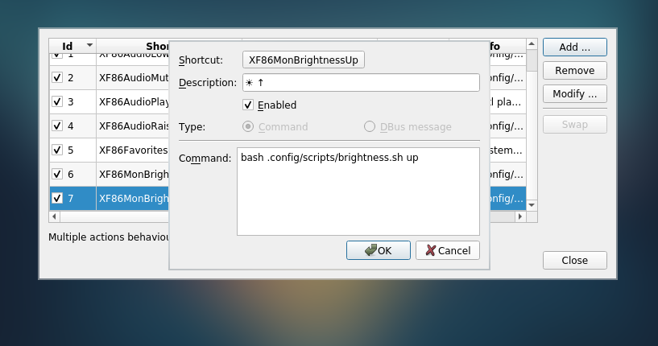
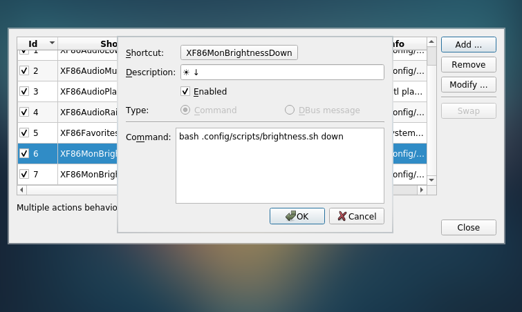
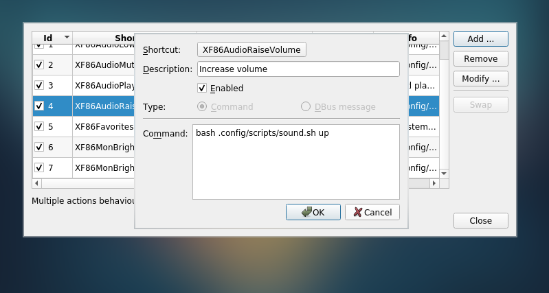
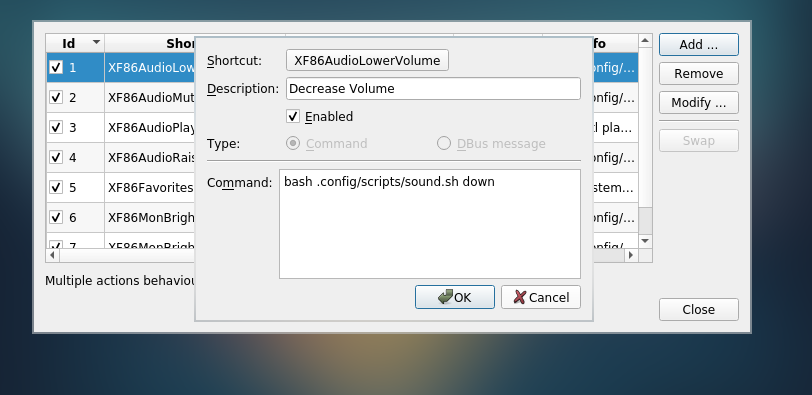

# Controle Brightness and Volume
I created two scripts to show an animation and manage the brightness/volume.
PS: Am not a fucking master in bash, really I learned doing this scripts!
PSS: If you want, you can modify and make that scripts better and make a pull request :D. 
## Dependecies
* https://github.com/hcchu/volnoti
* https://github.com/jukil/volnoti-brightness
* A global shortcut manager. I use ```lxqt-config-globalkeyshortcuts```

## Instalation
* Install the depencies first :D
* In your shortcut file o manager select the keys what you want call the brightness


* And now the volume keys



